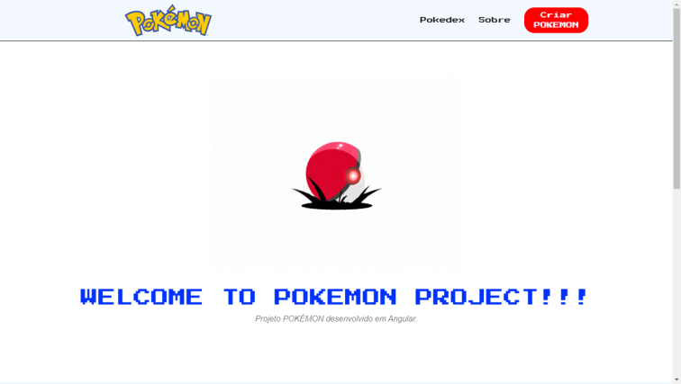

# POKEMON | POKEDEX

`🪁 | Projeto em Angular JS - POKEDEX`

 

 

# Pokedex | Angular Js   (DESENVOLVIMENTO)

* **`API RESTful com AdonisJS`**
    * [Vídeo no YouTube](https://www.youtube.com/watch?v=y8XfJJYhXPE&t=0s&ab_channel=MatheusBattisti-HoradeCodar)

* **`POKÉAPI`**
    * [Link](https://pokeapi.co/)

<strong>AdonisJS</strong>

* Um <mark>framework Nodej.js</mark>, para desenvolver aplicações web;

* Facilita muito a programação de apps, possui uma estrutura similar ao <mark>Laravel</mark>;

* Utilizar arquitetura <mark>MVC</mark>;

* Possui vários recursos, como: <mark>CLI, File Upload</mark> simples, <mark>validações</mark> e etc;

* Há também outros pacotes externos para complementar o ecossistema <mark>ORM, Autenticação, Autorização</mark>;

<strong>Detalhes</strong>

* Criação de uma <mark>API RESTful</mark>;

* <mark>CRUD</mark> e relacionamento entre entidades;

* Utilizar a <mark>CLI do Adonis e outros recursos</mark> excluisvos do framework;

* Testes realizados no <mark>Postman</mark>, para garantir o correto funcionamentoo da API;

 

<strong>[🪁] CRIANDO A API</strong>

* `npm init adonis-ts-app@latest` (Última versão do Adonis)

* `npm i @adonisjs/lucid`
    * `node ace configure @adonisjs/lucid` (SQLite > Terminal)

<strong>[🪁] MODEL</strong>

* `node ace make:model <nome-do-modulo> -m` (Criando model com migration)

* `node ace migration:run`

* `node ace make:controller <nome-do-modulo>` (Desenvolver a função do do banco de dados)

<strong>[🪁] ROUTES</strong>

* `node ace list:routes` (Ver lista de rotas da API)

<strong>[🪁] UPLOAD IMAGE</strong>

* `npm i uuid` (Upload de imagens)

* **Complete** - Support for RFC4122 version 1, 3, 4, and 5 UUIDs

* **Cross-platform** - Support for ...
    * CommonJS, [ECMAScript Modules](https://www.npmjs.com/package/uuid#ecmascript-modules) and [CDN builds](https://www.npmjs.com/package/uuid#cdn-builds)
    * Node 12, 14, 16, 18
    * _Chrome, Safari, Firefox, Edge browsers_
    * Webpack and rollup.js module bundlers
    * [React Native](https://www.npmjs.com/package/uuid#react-native--expo) / [Expo](https://www.npmjs.com/package/uuid#react-native--expo)

* **Secure** - Cryptographically-strong random values

* **Small** - Zero-dependency, small footprint, plays nice with "tree shaking" packagers

* **CLI** - Includes the uuid command line utility

<table>

<thead>

<tr align="center">

<th colspan="5">SOFTWARES</th>

</tr>

</thead>

<tbody>

<tr align="center">

<td>

</td>

<td>

</td>

<td>

</td>

<td>

</td>

<td>

</td>

</tr>

</tbody>

</table>

<strong>[🪁] INICIANDO A APLICAÇÃO ANGULAR</strong>

* `ng new <nome-do-projeto>` (Iniciando um projeto Angular)

* `ng serve` (Ativando o servidor)

<strong>[🪁] COMPONENTES</strong>

* `ng generate component <diretório do component>`
    * _header_
    * _footer_
    * **_pages_**
        * `home`
        * `about`
        * `new-pkmn`

* `npm i @fortawesome/angular-fontawesome` (**fortawesome**)

<strong>[🪁] SERVIÇOS</strong>

* `ng generate service <diretório do serviço>` (Interação com o banco de dados)

<strong>[🪁] ENVIRONMENTS</strong>

* `ng generate environments` (Usando a CLI do Angular, comece executando o comando gerar ambientes mostrado aqui para criar o diretório `src/environments/` e configurar o projeto para usar esses arquivos.)

# Pokedex | Angular Js   (HOME)

